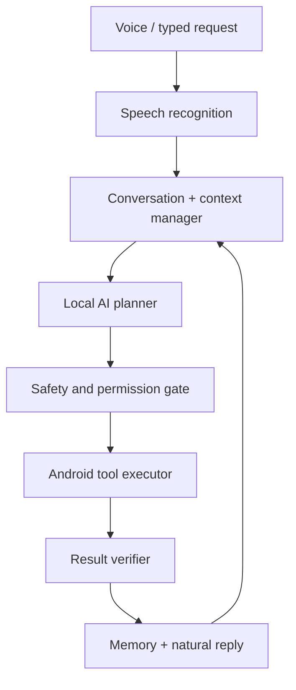
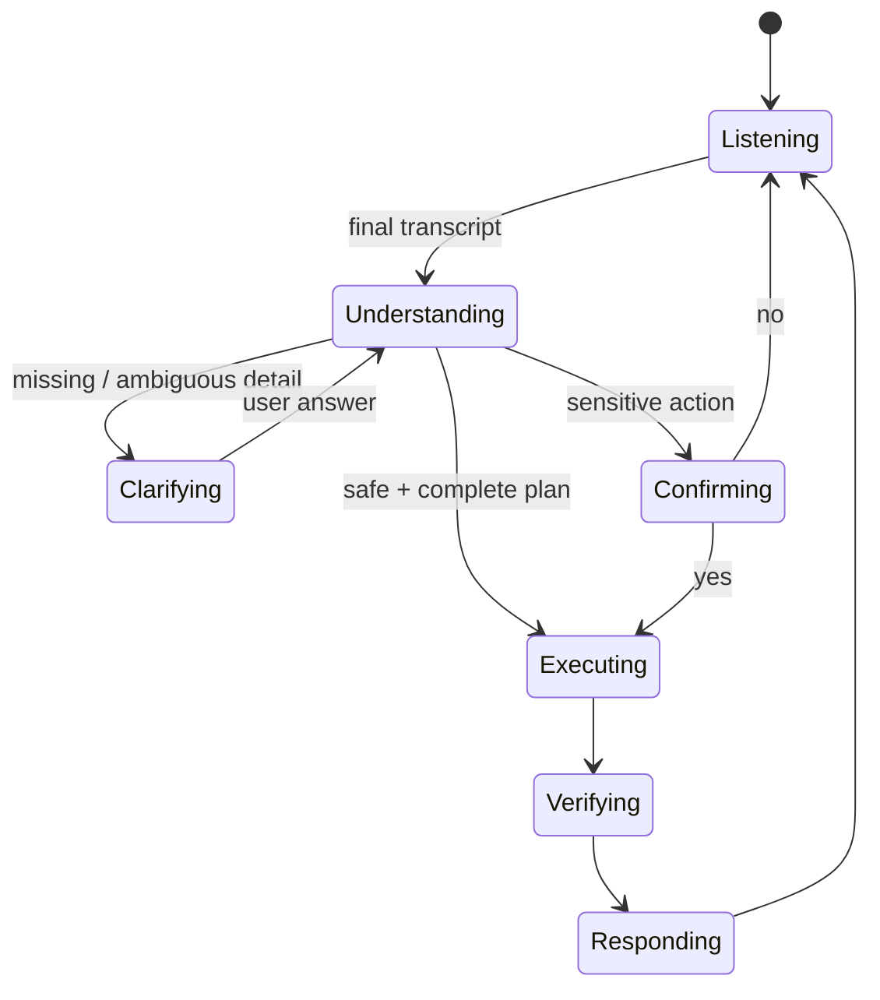

# IRIS — Real-Assistant Architecture & Roadmap

> **Purpose.** Reference document for evolving IRIS from a *command matcher* into a private,
> local **agent loop**. This is the plan we refer to before doing any work.
>
> **Status:** planning document only. **The shipped app is frozen at 8.6.1 (versionCode 287),
> which the user confirmed works perfectly. No code changes without an explicit request.**
>
> Compiled: 2026-09-09.

---

## 0. The one-line vision

> **hear → understand context → make a safe plan → use approved phone tools → verify result → remember it → respond naturally**

**Core rule that governs the whole design:**

> ### The AI may propose. IRIS code must decide.

Do **not** build one giant "AI" class that guesses commands. Build separate, testable layers.
That single rule prevents most dangerous and embarrassing assistant failures.

---

## 1. Honest limitations (accept these up front)

IRIS can feel very close to a real assistant, fully free and local-first. "Free" means the phone
pays instead of money:

- No paid API, no hosted server required.
- Models run on the phone → **battery, storage, RAM and latency are the cost**.
- It **cannot** silently control every third-party app. Android intentionally restricts this.
- It **cannot** unlock the phone, bypass banking-app protection, read protected screens, or
  bypass app permissions.

**Policy constraint:** use official app intents and Android APIs **first**. Use Accessibility only
for clearly user-triggered actions with visible consent — never as an autonomous agent. Google Play
explicitly restricts Accessibility-based autonomous planning/execution.
→ [Google Play Accessibility policy](https://support.google.com/googleplay/android-developer/answer/10964491?hl=en)

Do not claim watch-equivalent accuracy, universal lock-screen capability, or "trained voice model"
behaviour that does not exist.

---

## 2. Target architecture



*(Supplied diagram 2 shows exactly this pipeline: voice/typed request → speech recognition →
conversation + context manager → local AI planner → safety and permission gate → Android tool
executor → result verifier → memory + natural reply, looping back into the context manager.)*

### Layer responsibilities

| Layer | Responsibility | Must NOT do |
|---|---|---|
| Speech recognition | Produce best transcript + confidence | Interpret intent |
| Conversation + context manager | Track active task, pending fields, references ("it", "last one") | Execute anything |
| Local AI planner | Propose a **structured JSON plan** from a fixed tool list | Run Android code, invent tools/contacts |
| Safety + permission gate | Validate plan, check permissions, classify risk, ask/confirm | Assume the model was right |
| Android tool executor | Execute one validated tool at a time | Improvise beyond the tool contract |
| Result verifier | Confirm what actually happened (file exists, message sent) | Report success before Android confirms |
| Memory | Store action ledger, session state, prefs, explicit facts | Store secrets/screens silently |

---

## 3. Current pattern vs real-assistant pattern

| Current IRIS pattern | Real-assistant pattern |
|---|---|
| "contains 'screenshot' → take screenshot" | "I need a screenshot of the current page; screen capture tool is appropriate." |
| Guesses from keywords | Extracts intent, entities, time, target app, **confidence** |
| One command at a time | Keeps the current task and previous action |
| May execute incorrect actions | Asks when uncertain or when the action is sensitive |
| Fixed phrases | Understands many phrasings and follows up naturally |

### Worked example

> "Send the photo I just took to Rahul on WhatsApp and tell him I'll be five minutes late."

The planner must emit a **plan**, not free-form code:

```json
{
  "goal": "Share recent photo with Rahul and send a message",
  "steps": [
    { "tool": "find_recent_media", "arguments": { "type": "image", "limit": 1 } },
    { "tool": "resolve_contact",   "arguments": { "name": "Rahul" } },
    {
      "tool": "share_to_app",
      "arguments": {
        "package": "com.whatsapp",
        "media": "recent_image",
        "recipient": "Rahul",
        "text": "I'll be five minutes late"
      }
    }
  ],
  "needs_confirmation": true
}
```

IRIS then validates **every field**:
- Is there exactly one Rahul? (three Rahuls → ask which one)
- Is there a recent image?
- Does WhatsApp support the intended handoff?
- Does the user need to confirm before sending?

**It must never invent a contact, an app capability, or a successful result.**

---

## 4. Speech recognition — fix this before adding a bigger AI

A language model cannot reliably recover words that were transcribed wrongly. **STT is the first
bottleneck for an Indian accent.**

### Two-mode speech system

| Mode | Use | Privacy |
|---|---|---|
| **System recognizer `en-IN`** (default) | Best practical real-world Indian English | Depends on the device speech provider; **may go online** |
| **Offline / private mode** | No network, privacy mode | Fully on-device; slower, more RAM/battery |

- **Offline stack options:** multilingual **Whisper via `whisper.cpp`**, or **Sherpa-ONNX** with an
  Indian-English-capable model. Downloaded once; no voice data leaves the phone.
- **Wake word:** a **tiny dedicated offline model** — keep wake detection **separate** from command
  recognition. Never reuse the full recognizer for wake.
- Android's `SpeechRecognizer` has an on-device option on supported devices, but availability depends
  on the installed recognizer/model → treat as an **optional mode, not a promise**.
  → [Android SpeechRecognizer](https://developer.android.com/reference/android/speech/SpeechRecognizer)
- Do not rely only on Vosk's small model for natural Indian English commands; keep it as a
  lightweight fallback and offer a downloadable higher-accuracy offline mode.
- **Text-to-speech:** Android offline TTS voices where available (prefer `en-IN`).

### Confidence policy

| Confidence | Behaviour |
|---|---|
| High | Execute safe actions |
| Medium | Repeat back what IRIS understood |
| Low | **Ask once. Never execute.** |

### What "training" should actually do

Recording the user's voice does **not** magically train the recognizer — that is fake training.
Make training useful instead:

1. Ask the user to say **30–50 realistic sentences**.
2. Show the recognized text.
3. Let the user **correct** it ("IRIS heard / I meant" card).
4. Store corrections **locally** (only explicit corrections).
5. Build a **personal vocabulary**: contact names, place names, app names, frequent phrases,
   Indian pronunciations and alternate spellings.
6. Use this vocabulary to **bias/repair transcripts conservatively**.
7. **Never rewrite message content** unless the user approves.

Alias examples:

```text
"Maa"          → maa, ma, mom
"Soumyajit"    → soumya jeet, somojit
"Bhubaneswar"  → bhubaneswar, bhuvaneshwar
"WhatsApp Dad" → WhatsApp Dad, message Dad on WhatsApp
```

Behaviour examples:
- "Call Soumyajit" → accept variants ("Somojit", "Soumya jeet").
- "Text Maa I'm coming home" → **preserve the message exactly**.
- "Open Bhubaneswar weather" → treat *Bhubaneswar* as a place, not a command word.

Add an "IRIS heard / I meant" correction card after uncertain results. This gives real
personalization data **without cloud training**.

---

## 5. Local AI brain — a small LLM used **only** for planning

- `llama.cpp` compiled for Android via JNI.
- **1.5B–3B instruct model, 4-bit GGUF**, downloadable from Settings (clear RAM/storage warning).
- Run **only after a request** — never continuously in the background.
- Strict system prompt + **fixed tool list**.
- **Force JSON output**; validate the JSON in Java before executing anything.
- Reject invalid JSON or unknown tools; **fall back to the deterministic parser** if slow,
  unavailable, or invalid.
- The model must **never** get raw permissions, shell, or arbitrary code execution.
- Keep deterministic Java rules for critical actions.

### What the planner receives

```text
- User's latest transcript
- Active conversation state
- Last 3–5 relevant actions
- Allowed tools
- Installed / known apps
- Resolved contacts only when necessary
- Safety rules
```

It must **not** receive: unrestricted contacts, all notifications, passwords, or arbitrary private data.

### Example: contextual reference

> "I told you to record a video earlier — stop that and send the latest one to Dad."

```json
{
  "intent": "continue_previous_task",
  "reference": "last_camera_video",
  "actions": ["stop_video_recording", "share_latest_video"],
  "recipient": "Dad",
  "confirmation_required": true
}
```

The Java/Kotlin executor decides whether this is valid and possible.

---

## 6. Real memory — not just a `lastActionSummary`

Local **encrypted SQLite/Room** storage, four distinct memory types:

| Memory | Example | Retention |
|---|---|---|
| Short-term session | "We were recording a back-camera video." | Current session / a few hours |
| Action history | "Saved `VID_...mp4` at 18:24." | User-controlled, e.g. 30 days |
| User preferences | "Call Maa using SIM 1." | Until edited |
| Personal facts | "Dad means Arun Kumar." | **Explicitly saved only** |

### Action record schema

```json
{
  "id": "action_824",
  "time": "2026-09-09T18:20:00+05:30",
  "intent": "camera_video",
  "status": "saved",
  "resource_uri": "content://media/...",
  "summary": "Recorded a 43-second rear-camera video",
  "reversible": false
}
```

Also useful: `app` (e.g. "Chrome") for screen-context actions.

### What this unlocks naturally

- "What did you do last?"
- "Where did you save it?"
- "Send the last screenshot." / "Send the last one to Dad."
- "Stop that recording."
- "Do the same thing again." / "Do the same for Rohan."
- "Undo the reminder I just set."

For anything sensitive, read back the reference first:

> "You mean the rear-camera video saved two minutes ago. Send it to Dad on WhatsApp?"

That is what makes it feel **aware rather than reckless**.

**Settings controls required:** view memory, edit memory, export memory, clear all memory,
**private session mode** (never save transcript/history).

---

## 7. The Android tool layer (`ToolRegistry`)

Every capability becomes a small, testable tool.

```java
interface IrisTool {
    ToolDefinition definition();
    ToolResult execute(ToolCall call, ToolContext context);
}
```

### Tool catalogue (target)

```text
call_contact(name)                      resolve_contact(name)
compose_message(contact, text)          compose_sms(contact, text)
open_app(package)                       search_app(package, query)
search_web(query)
create_alarm(time, label)               create_reminder(time, text)
create_calendar_event(title, when)
take_screenshot()
record_camera_video(camera, duration)   stop_camera_video()
find_recent_media(type, limit)
share_file(file, target_app, recipient)
read_notifications()                    reply_to_notification(notification, text)
get_battery()                           get_location()
set_volume(level)                       control_media(action)
remember_fact(key, value)               recall_memory(query)
describe_current_screen()
```

### Every tool must declare

- required Android permission,
- whether it works while locked,
- whether it needs confirmation,
- what result it returns,
- **whether it is reversible**,
- whether it is supported by the selected app.

---

## 8. App interaction roadmap — safest integration first

**Level 1 — Official Android intents & deep links** (do these first; most reliable)
- Open apps; start calls; share photos/videos/text; email drafts; open navigation;
  search within apps that expose supported links.

**Level 2 — Android system integrations**
- Contacts, Calendar, alarms, media sessions, camera, notifications, files, volume, clipboard,
  battery, brightness, MediaStore, Share Sheet.
- Notification Listener reads allowed notifications; **`RemoteInput` can reply only where the app
  exposes a reply action**.

**Level 3 — App-specific connectors / adapters**

```text
WhatsAppAdapter   SpotifyAdapter   YouTubeMusicAdapter
GoogleMapsAdapter ChromeAdapter    PulseAdapter
```

- WhatsApp share intent; Spotify/media via Android MediaSession; browser search/open;
  Maps navigation intent; own **PULSE** app via a documented local intent or localhost API.
- IRIS may open WhatsApp with a prepared message — it must **not** claim it can invisibly operate
  every screen inside WhatsApp.

**Level 4 — Accessibility as an explicit last-mile option only**
- Valid: "IRIS, tap Send", "read this screen", "what error is showing here?"
- Show a visible banner: "Using accessibility to interact with WhatsApp."
- **Never** for: banking, payments, OTPs, passwords, unlocking, system security, or silent
  autonomous flows. (Play policy — see §1.)

> "Interacting with apps" means **use the safest supported integration first**, not screen-reading
> and clicking everything.

---

## 9. Become the default Android assistant

Implement Android's assistant role / **`VoiceInteractionService`** so the user can set IRIS as the
device assistant. → [VoiceInteractionService](https://developer.android.com/reference/android/service/voice/VoiceInteractionService)

Benefits: long-press power/home assistant gesture, assistant invocation, overlay-style interaction,
current-screen context where Android allows it, better assistant lifecycle handling.

**Do not depend on permanent microphone listening.** Keep all trigger choices:
wake phrase · notification "Talk" button · Quick Settings tile · headset button · watch action ·
assistant gesture · optional shake trigger · PULSE/watch local integration.

---

## 10. Screen awareness — built in careful levels

1. **Current app + visible text** — via Accessibility, only after the user enables it.
   *"What does this error mean?"*
2. **Screenshot OCR** — local ML Kit text recognition or a local OCR engine. *"Read this bill."*
3. **On-device image understanding** — optional small vision model, only on request.
   *"What is in this photo?"*
4. **Actionable context** — *"This is a delivery address. Do you want it copied to Maps?"*
5. **Explicit action mode** — "Read this", "Tap Send", "Scroll down", "Summarize this page",
   "Open the second result".

**Never** continuously read, analyze, or store screen contents in the background. Always explicit,
on-demand, and visibly indicated.

---

## 11. Conversation design — a state machine, not a forgetful chatbot



*(Supplied diagram 1 shows exactly these states and transitions: Listening → Understanding on
"final transcript"; Understanding branches to Clarifying on "missing / ambiguous detail", to
Confirming on "sensitive action", and to Executing on "safe + complete plan"; Clarifying returns to
Understanding via "user answer"; Confirming → Executing on "yes" and → Listening on "no";
Executing → Verifying → Responding → Listening.)*

### `ConversationState` must hold

- active task,
- pending missing fields,
- pending confirmation,
- current app,
- last referenced media,
- last action,
- **expiry time**.

### Follow-up flow

- User: "Send a message to Maa."
- IRIS: "What should I say?"
- User: "I'll be home by eight."
- IRIS: "Sending 'I'll be home by eight' to Maa. Is that right?"

### Action-reference flow ("Stop it.")

IRIS checks the active task:
- video recording active → "Stopping the rear-camera recording."
- IRIS is speaking → stop speech.
- **both active → ask which one.**

### Understanding examples

| What you say | What IRIS should understand |
|---|---|
| "Call Maa after ten minutes." | Delayed call **reminder**, not call now |
| "Stop that." | Stop current recording/task, or ask if multiple are active |
| "Send the last one to Dad." | Find last created media/action, resolve Dad, **confirm** send |
| "Remind me when I reach home." | **Location-based** reminder |
| "Open the one I was watching." | Resume recent media/app context |
| "Do the same for Rohan." | Reuse previous action, change recipient |

---

## 12. Safety and trust must be visible

| Level | Examples | Behaviour |
|---|---|---|
| **Safe** | Open app, battery, media pause, explain screen | Run immediately |
| **Confirm once** | Send message, place call, delete file, share photo, set reminder | Read back and ask |
| **Always confirm** | Payment, OTP, password, unlock, security setting, unknown recipient | Never automate silently |
| **Require unlock** | Private data, messages, sharing, account changes | Gate behind unlock |

Example that prevents most mistakes:

> "The latest video is a 43-second rear-camera recording saved two minutes ago.
> Send it to Dad on WhatsApp?"

Additional trust features:
- **Activity timeline** — "IRIS did this."
- **One-tap undo** where possible.
- **Per-tool permission dashboard.**
- **Private mode** — never save transcript/history.
- **Offline-only mode** — disable all network-capable providers.
- **Export / delete all personal data.**
- Visible **mic indicator** and **action indicator**.

---

## 13. Development order

### Phase 1 — Make listening trustworthy
- `en-IN` system recognition as default.
- Offline multilingual Whisper option.
- Transcript correction UI ("IRIS heard / I meant").
- Personal vocabulary + contact pronunciation aliases.
- **Measure recognition, not feelings.**

### Phase 2 — Replace keyword parsing with structured understanding
- Keep the existing parser as a **fast fallback**.
- Add `Intent`, `Entity`, `ToolCall`, `Plan`, `Confidence` models.
- Strict JSON output validation.
- Rule-based fallback for alarms, calls, camera, screenshots.
- Clarification flows.

### Phase 3 — Local memory + action ledger
- Save actions, media URIs, pending tasks.
- "last action", "repeat", "send the last image", "undo".
- Memory controls in Settings; facts remembered only after "remember that…".

### Phase 4 — Useful phone integrations (highest value first)
1. Contacts / calls / SMS
2. Camera, screenshot, screen recording, recent media
3. Alarms, reminders, calendar
4. App opening and search
5. Media controls
6. Notifications + supported replies
7. Maps / navigation
8. Files / share sheet

### Phase 5 — Local LLM planner
- Downloadable model in Settings; RAM/storage warning.
- Strict tool schema; no raw permission/shell/code access.
- Deterministic fallback on slow/unavailable/invalid output.

### Phase 6 — Assistant role, watch, lock-screen flows
- Default assistant (`VoiceInteractionService`).
- Quick Settings, headset, watch notification actions.
- **Lock-screen-safe actions only:** stop recording, media control, camera where Android/device
  policy permits, status updates.
- Require unlock for private data, messages, sharing, payments, account changes.

### Phase 7 — Screen awareness
- Opt-in Accessibility; OCR; "explain this screen".
- Explicit action mode only. **Never autonomous background interaction.**

### Consolidated build order
1. Finish `en-IN` recognition, confidence handling, transcript corrections, contact aliases.
2. Local action ledger + "last action" references.
3. Robust `ToolRegistry` with safe Android tools.
4. Conversation state: missing fields, confirmations, current task.
5. Intents / deep links / share integrations.
6. Downloadable local LLM planner with strict JSON tool calling.
7. Default-assistant role + watch/lock-screen entry points.
8. Opt-in screen reading / OCR.
9. Local memory preferences + private-mode controls.
10. Test suite with 100+ phrases in the user's own Indian accent.

---

## 14. Measurement — the definition of done

Build a test set of **at least 100 phrases** in the user's natural Indian accent, covering:
calls/messages · family names · Hindi/Bengali/Odia names spoken in English · mixed English phrases ·
camera/screenshot commands · follow-ups ("stop that", "send the last one").

Track:
- **word error rate**
- **command success rate**
- **wrong-action rate**
- **average response time**

> **Success target: no wrong action.**
> Asking once is better than confidently doing the wrong thing.

---

## 15. What NOT to build yet

- Full-time local LLM always listening.
- "Train my voice" that does not actually improve speech recognition.
- Automatic messaging without confirmation.
- Generic screen clicking across every app.
- An app that claims to work on the lock screen for everything.
- A 7B+ model on a normal phone — it will be slow, hot, and frustrating.

---

## 16. Where IRIS stands today (gap analysis)

### Phase 3 status (implemented in 8.9.0)

| Phase 3 item | Status |
|---|---|
| Save actions, media locations, pending tasks | ✅ `ActionLedger` — framework SQLite (`iris_actions.db`), columns: time, intent, status, summary, location, ref, reversible. Written **only after Android confirms** the action. |
| "last action" | ✅ "what did you just do?" now answers from the ledger, with the old in-memory summary as fallback |
| "where did you save it" | ✅ `handleWhereSaved` reads the real location |
| "send the last image" | ✅ `handleSendLast` + `RecentMedia` finds the newest actual file (IRIS folders first) and opens the share sheet **after reading back what it found** |
| "undo" | ✅ `handleUndo` cancels the last reminder's `PendingIntent` (stored request code); non-reversible actions say so honestly |
| Activity timeline | ✅ Settings → "What IRIS did", with Clear history |
| Retention | ✅ 30-day auto-purge on every write; manual clear |
| Memory controls | ✅ ledger clear + vocabulary clear + memory screen (facts) |

The four memory types of §6 now all exist: session (`ConversationManager`), **action history (new)**,
preferences (`AppSettings`), explicit facts (`MemoryStore`).

### Phase 5 status (planner layer implemented in 8.9.0; native engine deferred)

| Phase 5 item | Status |
|---|---|
| Strict tool schema | ✅ `ToolCall.KNOWN` whitelist; the prompt is generated from it so they cannot drift |
| Planner layer + prompt | ✅ `LocalPlanner` — engine-agnostic (`LocalPlanner.Engine`), strict JSON-only prompt with the 6 safety rules and two worked examples |
| Validation | ✅ `Plan.fromJson` + a second gate (confidence ≥ 0.45, all tools known) |
| No model access to permissions/shell/code | ✅ the model returns text; the plan is inert data; execution converts it to a canonical command string routed through the **existing** handlers |
| Deterministic fallback | ✅ any doubt → `Plan.unknown()` → conversation/regex path unchanged |
| Runs only after a request | ✅ invoked only when the router already failed, and only when AI is enabled in Settings |
| Downloadable model in Settings | ⚠️ Uses the **already-integrated** MediaPipe engine (opt-in, off by default) |
| `llama.cpp` + GGUF 1.5–3B | ⛔ **Deferred** — needs a native NDK/JNI build |

#### Detailed Phase 5 completion plan (the remaining native work)

**Why it is deferred.** `llama.cpp` requires CMake/NDK `externalNativeBuild`, per-ABI binaries, a
~1–2 GB 4-bit GGUF download, and careful memory tuning. It cannot be compiled or crash-tested from
this environment, and the app has a real history of *uncatchable native crashes* from on-device
inference. Shipping it blind would risk the working build.

**Step-by-step when we do it (own branch, device testing at each step):**

1. **Prove the planner layer with the current engine.** Enable AI in Settings and check the
   `PLANNER` lines in Logs. If plan quality is poor, fix the prompt before adding any native code.
   *No new risk; this is already shippable today.*
2. **Add the native module.** `app/src/main/cpp/` + `CMakeLists.txt`, `llama.cpp` as a submodule,
   `externalNativeBuild { cmake { ... } }`, `ndkVersion`, `abiFilters "arm64-v8a"` only (keeps the
   APK sane and covers the target phone).
3. **Thin JNI wrapper.** `LlamaBridge` with `nativeInit(modelPath, threads, ctx)`,
   `nativeGenerate(prompt, maxTokens)`, `nativeFree()`. Load with
   `try { System.loadLibrary("iris_llama"); } catch (Throwable)` so a missing/incompatible library
   degrades to "planner unavailable" instead of crashing.
4. **Guard against native crashes** exactly as `LlmAgent` does today: an "inference_active" flag in
   SharedPreferences set before a call and cleared after, so a crash-loop auto-disables the planner
   on next launch.
5. **Model manager.** Download the GGUF on Wi-Fi only, verify size/SHA, store in app-private files,
   show progress, allow delete. Never bundle it in the APK.
6. **Wire as a second `LocalPlanner.Engine`.** No change to `LocalPlanner`, `Plan`, or the executor
   — that is the point of the interface. Pick the engine in Settings (MediaPipe / llama.cpp / off).
7. **Budget + cancellation.** Run on a single worker thread, hard timeout (`BUDGET_MS`), cancel on
   a new utterance, and fall back to the deterministic path when the budget is exceeded.
8. **Expand coverage deliberately.** Add one intent at a time to `ToolCall.KNOWN` +
   `commandFor(...)`, each with `PlanTest`/`LocalPlannerTest` cases, measuring the wrong-action
   counter in the Recognition report after each addition.
9. **Multi-step plans.** Only after single-step plans are reliable: execute steps sequentially,
   verify each via the ledger, and abort the rest on the first failure.
10. **Ship behind a clearly-labelled opt-in** with RAM/battery/storage warnings.

**Acceptance criteria before enabling it by default:** zero wrong actions across the 100-phrase
accent set, p95 plan latency under ~2.5 s, and no native crash in a week of daily use.

### Phase 2 status (implemented in 8.8.0)

| Phase 2 item | Status |
|---|---|
| `Intent`, `Entity`, `ToolCall`, `Plan`, `Confidence` models | ✅ `IrisIntent`, `ToolCall` (+whitelist), `Plan` (entities/steps/missing/confidence) |
| Strict JSON output validation | ✅ `Plan.fromJson` — rejects unknown intents, unknown tools, malformed steps, garbage; tolerates prose-wrapped JSON; sensitive intents still require confirmation |
| Rule-based fallback for alarms, calls, camera, screenshots | ✅ `IntentParser` covers alarm, timer, call, screenshot, screen record, camera video, voice memo, torch |
| Clarification flows | ✅ Missing detail → IRIS asks one question ("What time should I set the alarm for?"), then completes the command |
| Keep the existing parser | ✅ **Deliberately inverted for safety:** the proven keyword router still handles every complete command. The structured layer currently only intervenes when a command is *understood but incomplete*. Nothing that worked before changed path. |

**Why the inversion.** The roadmap says structured-first with regex as fallback. The shipped router
is known-good, and re-routing every working command could regress it with no way to test on device
from here. So the structured layer was added where it can only help (asking instead of failing).
Flipping the order should be done incrementally per intent, each backed by tests.

### Phase 1 status (implemented in 8.7.0)

| Phase 1 item | Status |
|---|---|
| `en-IN` system recognition as default | ✅ Done in 8.6.1 |
| Confidence handling (never act on a low-confidence guess) | ✅ Done in 8.6.1 (`SpeechText.lowConfidence` → retry) |
| Transcript correction UI ("IRIS heard / I meant") | ✅ **8.7.0** — `showHeardMeantCard`, offered automatically after two unclear tries, after a reported wrong action, and manually from Settings |
| Personal vocabulary + contact pronunciation aliases | ✅ **8.7.0** — `PersonalVocabulary` (whole-utterance corrections + name variants, applied conservatively) |
| Recognition measurement | ✅ **8.7.0** — `RecognitionStats` + "Recognition report" (attempts, first-try clear rate, wrong actions, avg latency) |
| **Offline multilingual Whisper option** | ⛔ **Deferred — see below** |
| 100+ phrase accent test set | ⏳ Manual task for the user; the report screen now provides the counters to score it |

#### Why Whisper is deferred (honest reasoning)
`whisper.cpp` needs a **native NDK/JNI build** (CMake + `externalNativeBuild`, ABI splits, a
~75 MB+ model download). That is a large, unverifiable change to a build that currently works, and
it cannot be compiled or tested from this environment — exactly the kind of change that previously
caused native crashes. It should be its own phase, done on a branch, with on-device testing.

**What already provides an offline/private path today:**
- `Settings → Prefer on-device speech` (passes the system recognizer's offline preference), and
- the **Vosk `en-IN`** engine as the automatic fallback when there is no network,
- with the optional **large en-IN model** for better accuracy.

So "no network" already works; "Whisper-quality offline" is the open item.

### Full component gap analysis

Current shipped baseline, recorded for planning only — **do not change without an explicit request.**

| Area | Today (8.7.0) | Gap to target |
|---|---|---|
| Speech (commands) | System recognizer default, **`en-IN`**, language spinner, "Set up Indian English accuracy", low-confidence retry gating | Whisper/Sherpa offline mode (deferred, see above) |
| Transcript repair | `SpeechText` normalization **+ `PersonalVocabulary`** (user-taught corrections & name variants) | Auto-seed variants from the contact list; fuzzy phonetic matching |
| Correction UX | **"IRIS heard / I meant" card** (auto after unclear/wrong action, plus Settings entry) | Batch training session (30–50 guided sentences) |
| Measurement | **`RecognitionStats` report**: attempts, first-try rate, wrong actions, corrections, avg latency | Word error rate against a fixed 100-phrase script |
| Wake | Text/grammar-based multi-phrase wake, zero-training default, speaker-lock optional (off) | Dedicated tiny wake model, separate from the recognizer |
| Understanding | Regex/keyword routing in `handleCommandInner` (order-dependent) | **Phase 2:** `Intent`/`Entity`/`Plan`/`Confidence` models; keep regex as fast fallback |
| Planner | `LlmAgent` (MediaPipe Qwen) — opt-in, off by default, native-crash guarded | **Phase 5:** `llama.cpp` + strict JSON tool calling |
| Memory | `ConversationManager` + `lastUserCommand` / `lastActionSummary`; `MemoryStore` facts | **Phase 3:** Room action ledger (URI/status/reversibility) + 4 memory types + expiry |
| Tools | Capabilities are inline handlers inside a very large `IrisListeningService` | **Phase 4:** extract `ToolRegistry` with per-tool contracts |
| Confirmation | Ad-hoc per feature (SMS compose, call confirm) | Formal 4-tier risk classification + read-back everywhere |
| Assistant role | `ACTION_ASSIST` intent-filter (+ notification Talk, QS tile, headset, shake) | **Phase 6:** real `VoiceInteractionService` |
| Screen awareness | Accessibility service used **only** for dialog-free screenshots | **Phase 7:** opt-in visible-text reading + OCR |
| Interrupt | ⏹ Stop notification action + `stopSpeaking()` | Context-aware "stop it" that chooses between speech/recording |
| Trust UI | Logs, self-test, memory screen, **recognition report, vocabulary view** | Activity timeline, undo, per-tool permission dashboard, private/offline-only modes |

### Suggested next step
**Phase 3 (Room action ledger)** is the highest value at the lowest risk: it makes
"send the last one", "where did you save it", and "undo" real, and it is pure Java/SQLite with no
native code. Then extract the **`ToolRegistry`** (Phase 4) *before* attempting the LLM planner.

---

## 17. The final product vision

> "IRIS, I'm running late. Tell Maa I'll reach in twenty minutes, start navigation home, and remind
> me to call Rohan when I get there."

IRIS:

> "I found Maa and your home address. I'll send: 'I'll reach in twenty minutes,' start navigation,
> and create a location-based reminder for Rohan. Should I continue?"

After confirmation:

> "Done. Navigation is open, Maa's message is queued, and I'll remind you when you arrive home."

That is real assistant behaviour: **language understanding, context, planning, execution,
verification, memory, and restraint** — not keyword guessing.

---

## References

- [Google Play Accessibility policy](https://support.google.com/googleplay/android-developer/answer/10964491?hl=en)
- [Android `SpeechRecognizer`](https://developer.android.com/reference/android/speech/SpeechRecognizer)
- [Android `VoiceInteractionService`](https://developer.android.com/reference/android/service/voice/VoiceInteractionService)
